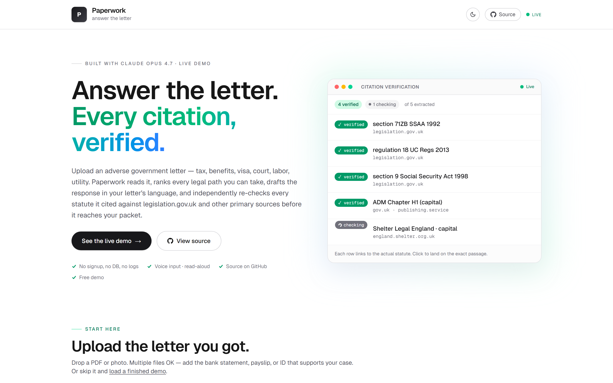
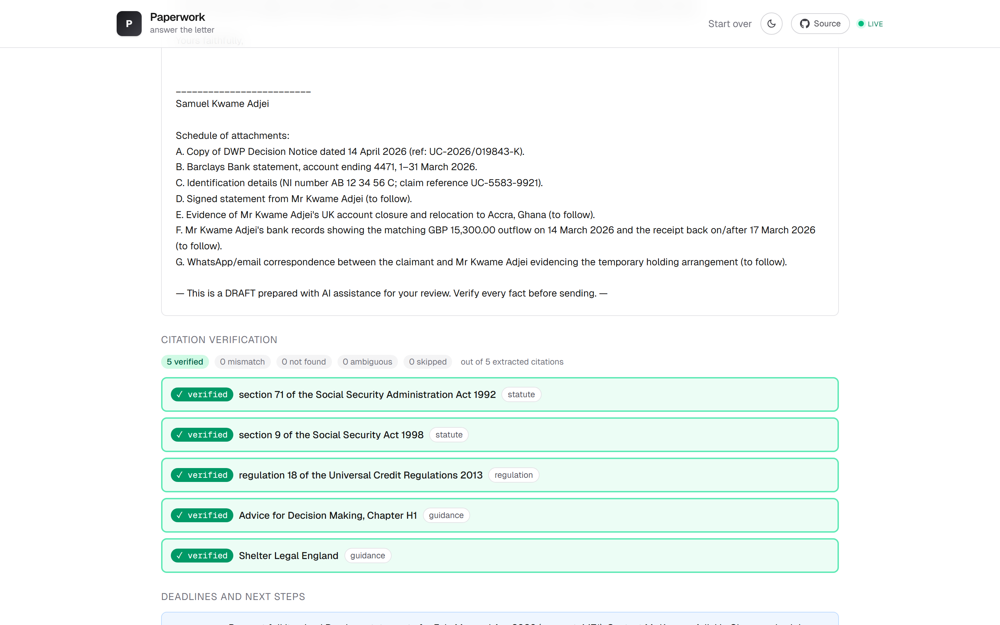
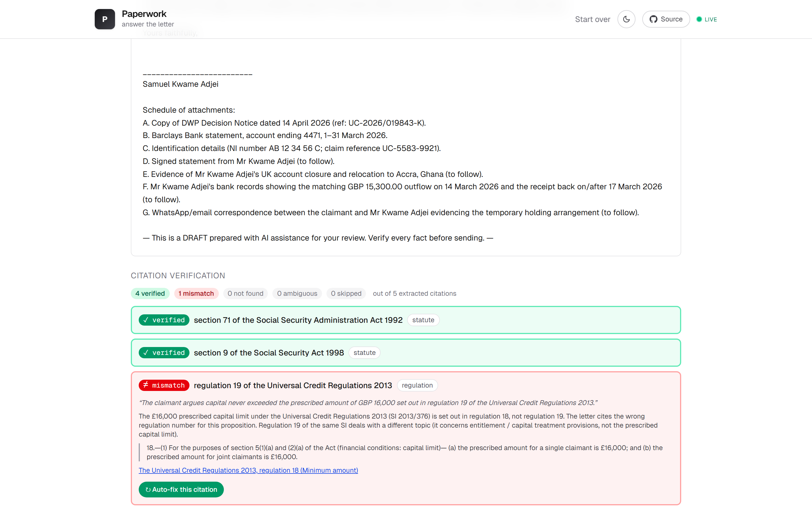
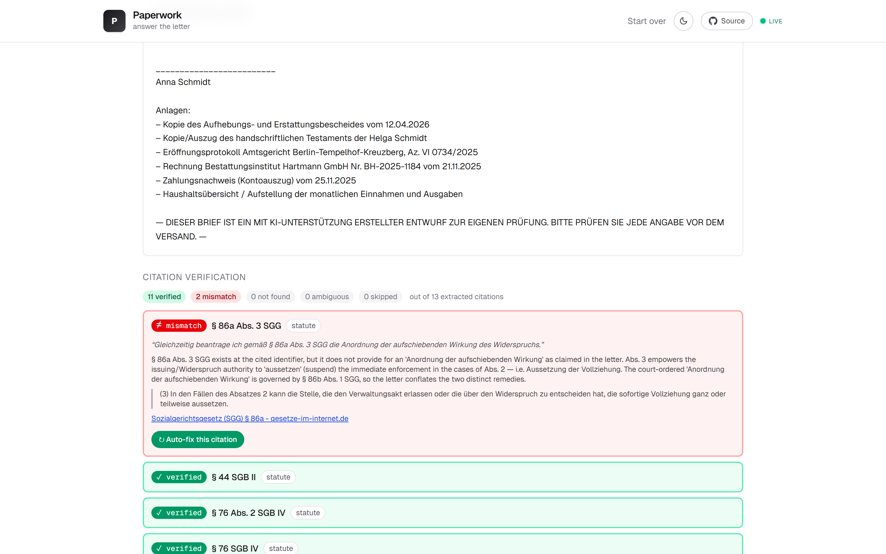
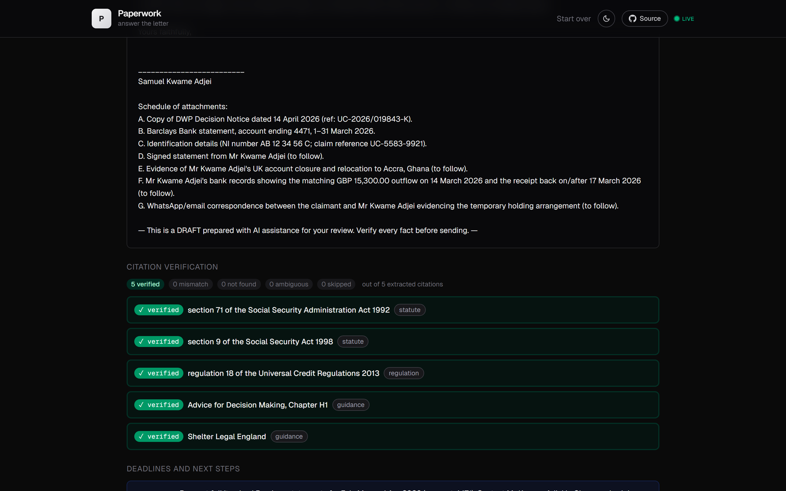

<div align="center">

<h1>Paperwork</h1>

**Answer the letter. Every citation, verified.**

AI that reads adverse government letters and drafts a defensible response — every legal citation independently verified against `legislation.gov.uk`, `gesetze-im-internet.de`, `eur-lex` and other primary sources, before it lands in your packet.

[](https://www.anthropic.com/claude/opus)
[](https://nextjs.org)
[](https://www.typescriptlang.org/)
[](#license)
[](https://passage.gudman.xyz)

[**🌐 Live demo**](https://passage.gudman.xyz) · [Why](#why-paperwork-exists) · [How it works](#how-it-works) · [Quickstart](#quickstart) · [Architecture](#architecture) · [Roadmap](#roadmap)

</div>

---



## Why Paperwork exists

Adverse government letters cost ordinary people billions of dollars in claims they should win, every year, in every country. The pattern is the same everywhere:

- The letter arrives. It cites statutes most people can't decode.
- The deadline is short — usually 14–30 days.
- A welfare advisor / immigration lawyer / tax accountant costs £200–€400 an hour. That's a week of disposable income for one letter.
- So three things happen, all losing: the poor sign without reading, the middle pay £600–£1,500 for a one-page response, and the rest ignore it and get garnished, deported, sued, evicted.

"AI legal tool" has its own credibility problem: a confident, beautifully-formatted letter that cites a regulation that doesn't exist is **worse than ignoring the letter**.

**Paperwork's spine is built around that single failure mode.** Every citation that ends up in your draft is independently re-verified against the actual statute. You can click any row in the audit table and land on the exact passage of `legislation.gov.uk` it was confirmed against. When the verifier catches a wrong citation — and it does — a single click rewrites the affected sentence using the primary source the verifier just found.

## What it does

<table>
<tr>
<td valign="top" width="50%">

### 📄 Read
Vision model extracts the authority, deadline, identifiers, and key facts from any uploaded letter — PDF or photo, any language. Translates non-English letters to English on the side.

### ✏️ Draft & ground
Web-grounded analyze ranks every realistic response option (appeal, contest, negotiate, escalate, comply). Web-grounded draft writes the letter in the source language, in proper legal register. Refuses to fabricate section numbers — paraphrases when search budget can't confirm.

</td>
<td valign="top" width="50%">

### ✓ Verify (the spine)
A second-pass agent extracts every legal citation from the draft and **independently** checks each one against primary sources via streaming. Per-citation status: `verified` / `mismatch` / `not_found` / `ambiguous` / `skipped`. Click any row → land on the actual statute. **Auto-fix** rewrites broken citations using the verifier's primary-source URL.

### ⚔️ Harden
Three more agents stress-test the draft — a counterparty plays the issuing authority and finds weaknesses, researchers gather public evidence in parallel, a reviser rewrites. The audit trail goes in your packet.

</td>
</tr>
</table>

Plus: voice input (speak your context), read-aloud (hear the response), shareable PDF packet with the citation audit table embedded, multilingual support (English, German, French, Spanish, Portuguese, Italian, Polish, etc.), light/dark mode.

## See it in action

### Citation verifier (UK Universal Credit case · 5/5 verified)
Every legal reference in the draft confirmed against `legislation.gov.uk`. Click any row to expand notes + jump to the source.



### "We caught our own fake" — corrupted draft
The same UK case with `regulation 19` deliberately swapped in for `regulation 18`. The verifier returns `mismatch`, points at the *correct* `/regulation/18` page, quotes the actual £16,000 capital-limit passage, and offers an **Auto-fix** button that rewrites the sentence in ~70 seconds.



### Multilingual (German Bürgergeld appeal · 11/13 verified)
Letter and citations in German legal register, checked against `gesetze-im-internet.de`. Two of the 13 returned `mismatch` — real findings the user can investigate before sending.



### Dark mode



## How it works

```
                   ┌─────────────────┐
                   │   Letter (PDF/  │
                   │     photo)      │
                   └────────┬────────┘
                            │
                            ▼
       ┌────────────────────────────────────────────┐
       │  1. Read   (Opus 4.7 vision)               │
       │     authority, deadline, key facts,        │
       │     translation                            │
       └────────────────────┬───────────────────────┘
                            │
                            ▼
       ┌────────────────────────────────────────────┐
       │  2. Analyze   (web_search-grounded)        │
       │     ranks every response option            │
       │     citations verified against primary law │
       └────────────────────┬───────────────────────┘
                            │
                            ▼
       ┌────────────────────────────────────────────┐
       │  3. Draft   (web_search-grounded)          │
       │     letter in source language              │
       │     proper legal register                  │
       │     refuses to fabricate citations         │
       └────────────────────┬───────────────────────┘
                            │
                            ▼
       ┌────────────────────────────────────────────┐
       │  4. Verify   (streaming SSE)               │
       │     extractor pulls every citation         │
       │     verifier checks each against primary   │
       │     ✓ verified / ≠ mismatch / ✗ not_found  │
       │     auto-fix rewrites broken citations     │
       └────────────────────┬───────────────────────┘
                            │
                            ▼
       ┌────────────────────────────────────────────┐
       │  5. Harden   (3-agent SSE loop)            │
       │     counterparty attacks the draft         │
       │     researchers gather evidence (parallel) │
       │     reviser rewrites with new evidence     │
       └────────────────────┬───────────────────────┘
                            │
                            ▼
                   ┌─────────────────┐
                   │  Filing packet  │
                   │  (PDF, audit    │
                   │   table inside) │
                   └─────────────────┘
```

Every stage feeds the next; every stage's output is browser-state and never persisted server-side.

## Quickstart

### Run locally

```bash
git clone https://github.com/Ridwannurudeen/paperwork
cd paperwork
cp .env.local.example .env.local                 # then paste your ANTHROPIC_API_KEY
npm install
npm run dev
```

Open http://localhost:3000 — click any of the three pre-loaded demo cases on the homepage to see a finished case (no API call), or upload your own letter for the full pipeline.

### Try it without installing anything

Visit **[passage.gudman.xyz](https://passage.gudman.xyz)** and click **🇬🇧 UK · 5/5 verified** on the homepage. The response, citation audit, and pre-recorded harden replay all load instantly — no signup, no waiting.

### Use the API directly

Each route is a normal Next.js App Router handler. Example: stream the citation verifier for a draft you already have.

```ts
const r = await fetch("https://passage.gudman.xyz/api/verify", {
  method: "POST",
  headers: { "Content-Type": "application/json" },
  body: JSON.stringify({ response, jurisdiction_hint: "United Kingdom" }),
});

const reader = r.body!.getReader();
const dec = new TextDecoder();
let buf = "";
while (true) {
  const { value, done } = await reader.read();
  if (done) break;
  buf += dec.decode(value, { stream: true });
  let idx;
  while ((idx = buf.indexOf("\n\n")) !== -1) {
    const frame = buf.slice(0, idx); buf = buf.slice(idx + 2);
    const line = frame.split("\n").find((l) => l.startsWith("data: "));
    if (!line) continue;
    const evt = JSON.parse(line.slice(6));
    if (evt.type === "verifier_done") {
      console.log(evt.verification.status, evt.verification.source_url);
    }
  }
}
```

API routes (all rate-limited per IP):

| Route | Method | Purpose |
|---|---|---|
| `/api/ingest` | `POST` (multipart) | Vision extraction from PDF / image |
| `/api/analyze` | `POST` (JSON) | Ranked response options, web-grounded |
| `/api/draft` | `POST` (JSON) | Response letter in source language, web-grounded |
| `/api/verify` | `POST` (JSON, **SSE**) | Streaming per-citation verifier |
| `/api/fix-citation` | `POST` (JSON) | Auto-fix one wrong citation |
| `/api/harden` | `POST` (JSON, **SSE**) | 3-agent adversarial loop |
| `/api/packet` | `POST` (JSON) | Downloadable PDF with audit table |

## Architecture

- **Stack**: Next.js 16 (App Router, Turbopack), TypeScript strict, Tailwind v4, Anthropic SDK 0.91.0
- **Runtime**: Node.js 23 on Ubuntu 24.04 (Contabo VPS), nginx in front
- **Streaming**: native `ReadableStream` + SSE with 10s heartbeats; nginx tuned for 900s long-poll
- **Validation**: Zod schemas at every model boundary — every JSON output is parsed and rejected if malformed
- **Citation grounding**: Anthropic `web_search_20260209` server tool, with prompts that explicitly forbid section numbers from memory
- **Auto-fix**: dedicated reviser agent that rewrites only the affected sentence, citing the verifier's already-found primary source
- **No DB**: case state lives in the React tree; nothing persisted server-side after the response is delivered
- **No auth**: every session is anonymous and ephemeral

### Source verification

The verifier prefers primary sources, in this order:

| Domain | Jurisdiction |
|---|---|
| `legislation.gov.uk` | UK statute and SI |
| `gesetze-im-internet.de` | Germany |
| `eur-lex.europa.eu` | EU |
| `legifrance.gouv.fr` | France |
| `boe.es` | Spain |
| `planalto.gov.br` | Brazil |
| `laws-lois.justice.gc.ca` | Canada |
| `uscode.house.gov` / Cornell LII | US federal |
| `gov.uk` (e.g. Advice for Decision Making) | UK agency guidance |
| Court registries, gazettes | various |

Secondary sources (Westlaw summaries, reputable nonprofits like Shelter Legal England) are accepted as a fallback.

## Project layout

```
app/
  api/
    ingest/        vision extraction
    analyze/       web-grounded option ranking
    draft/         web-grounded letter drafting
    verify/        streaming citation verifier (SSE)
    fix-citation/  auto-fix endpoint
    harden/        3-agent adversarial loop (SSE)
    packet/        PDF generation
  layout.tsx       theme bootstrap, metadata, OG/Twitter
  page.tsx         single-page client UI (all stages)
  globals.css      Tailwind v4 + theme + hero animations
  robots.ts

lib/
  anthropic.ts     LLM helpers (jsonMessage, jsonMessageWithWebSearch)
  prompts.ts       system prompts (forbid fabricated citations)
  rate-limit.ts    in-memory per-IP token bucket
  types.ts         Zod schemas / TS types for every route
  fonts/           Noto Sans (embedded into PDFs for non-Latin scripts)

public/
  demo/            three pre-loaded cases (UK, German, corrupted)
  
scripts/
  capture-screenshots.mjs   Playwright-driven README screenshot capture
  smoke-verify-stream.mjs   end-to-end smoke for /api/verify
  smoke-fix-citation.mjs    end-to-end smoke for /api/fix-citation
  test-json-repair.mjs      unit tests for the model-output parser
```

## Honest limitations

- **PDF script coverage**: v1 embeds Noto Sans (Latin Extended + Cyrillic + Greek). Arabic, Hebrew, and CJK responses render correctly in the browser but the PDF download is disabled in the UI for those scripts. RTL + CJK fonts are roadmap.
- **Public deployment is rate-limited**: each IP gets 30 ingests, 10 analyses, 10 drafts, 5 verifies, 10 auto-fixes, 3 hardens, 30 packet downloads per hour. These are demo cost-caps, not product caps. Run locally for unlimited use.
- **Voice input** routes audio through your browser's built-in speech service (Google in Chrome, Microsoft in Edge, Apple in Safari). We never see the audio. Read-aloud (TTS) runs entirely on-device.
- **No formal expert-review eval shipped yet.** Verification is end-to-end correctness on six public-thread-anchored cases. A formal paralegal-scored eval is on the roadmap.

## Roadmap

- [ ] **Real human cases** with permission to publish anonymized outcomes
- [ ] **Comparison-to-baseline** eval against Citizens Advice / paralegal-template responses, scored by a UK welfare paralegal
- [ ] **Public Receipt URLs** — every case generates a shareable, anonymized audit page (`/r/{id}`) with the redacted letter, agent transcript, citation table, and evidence binder
- [ ] **RTL + CJK fonts** in the packet PDF (Noto Sans Arabic + Noto Sans CJK)
- [ ] **Lawyer hand-off** for cases the verifier flags as ambiguous or where the user is escalating to court
- [ ] **Server-side STT fallback** (Whisper) so Firefox desktop users get voice input

## Contributing

PRs welcome — please:

- Match the existing TS strictness and Zod-everywhere validation pattern
- Keep prompts in `lib/prompts.ts`; do not inline them in route handlers
- Add a smoke script under `scripts/` for any new route
- Run `npx tsc --noEmit` before pushing

## Development scripts

```bash
npm run dev                                    # local dev server
npm run build && npm start                     # prod build
node scripts/smoke-verify-stream.mjs           # E2E smoke for /api/verify
node scripts/smoke-fix-citation.mjs            # E2E smoke for /api/fix-citation
node scripts/test-json-repair.mjs              # unit tests for the JSON parser
node scripts/capture-screenshots.mjs           # regenerate README screenshots
```

## Disclaimer

Paperwork produces drafts for human review. Not legal advice. You are responsible for the accuracy of anything you submit to any authority. Every drafted response closes with a disclaimer in the document's source language.

## License

MIT — see [LICENSE](LICENSE).

## Contact

- Live: **[passage.gudman.xyz](https://passage.gudman.xyz)**
- Source: **[github.com/Ridwannurudeen/paperwork](https://github.com/Ridwannurudeen/paperwork)**
- Built solo with [Claude Opus 4.7](https://www.anthropic.com/claude/opus). No co-authors, no investors, no team yet.
